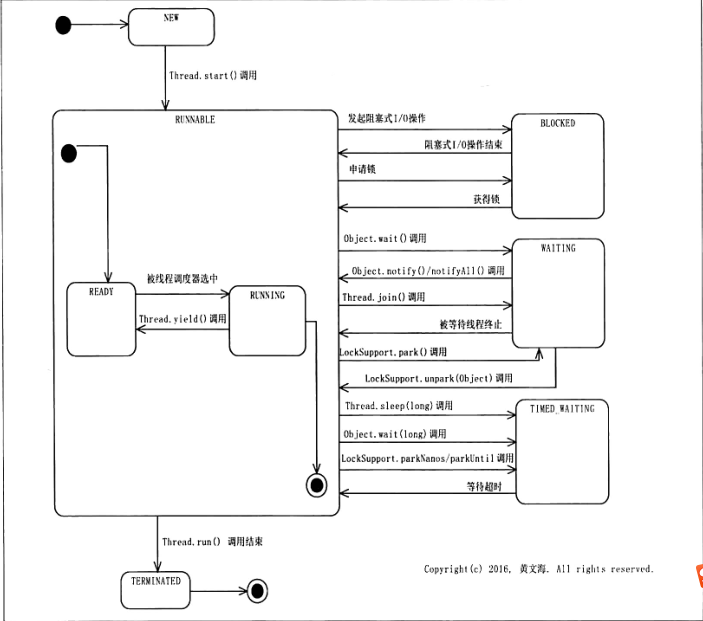

# Java基础系列-线程生命周期
## 概述
Java中的线程生命周期包含多个阶段，各个阶段直之间还存在往复跳转，Thread是Java中对线程的抽象表示，在其中定义了一个枚举用来表示线程的状态。
我们来简单看看这个枚举：
```java
public enum State {
    NEW,// 新建状态
    RUNNABLE,// 可运行状态
    BLOCKED,// 阻塞状态
    WAITING,// 等待状态
    TIMED_WAITING,// 限时等待状态
    TERMINATED;// 终结状态
}
```
## 状态解析
### NEW
NEW代表一个线程处于新建状态，我们知道线程是依靠start方法启动的，NEW表示的就是线程创建完成到启动之前的线程阶段，表示存在一个未启动的线程。
### RUNNABLE
RUNNABLE是可运行状态，它是NEW的下一个阶段，它有两种可能，或者子状态，这个子状态并未在枚举中罗列，但却是切实存在的子状态，处于RUNNABLE状态的线程只能处于这两种子状态的一种状态。
#### READY 
READY表示线程处于准备就绪状态，但并未被CPU分配时间段来执行，现在线程就在等待线程调度器进行调度。
#### RUNNING
RUNNING表示线程处于运行中状态，处于READY的线程被线程调度器调度获取到CPU分配时间而得以执行时，状态变为RUNNING运行中状态。如果这时候对线程执行Thread.yield()让步操作，线程会停止执行，会退到READY状态。
### BLOCKED
BLOCKED表示线程处于阻塞状态，当一个线程正在访问一个阻塞式IO，或者正在等待获取某个独占锁的时候就会处于这种状态，这种状态的线程无法执行，待阻塞IO完毕，或者线程得到了独占锁之后线程才会再次变成RUNNABLE->READY状态等待执行。
如果一个线程需要获取某个独占锁的话，当它被start方法启动之后，处于READY状态，再处于RUNNING状态，执行到需要获取锁的位置时，就会因为获取不到这个锁而转变成BLOCKED状态。
### WAITING
WAITING表示一个线程处于等待状态，这个等待与上面的阻塞的等待不同，上面是被动进入等待的，等待的是阻塞IO或者独占锁，而这里是被线程主动设置为等待，这种等待需要其他线程来唤醒。
一个线程在执行Object.wait()、Thread.join()、LockSupport.park(Object)方法之后就会进入等待状态，而这些方法却都是与锁息息相关的，也就是说，这些方法的调用必然在锁的临界区内。
进入等待状态的线程将一直等待，直到被唤醒后会再次尝试获取锁，如果获取成功，会变为READY状态等待调度。
### TIMED_WAITING
TIMED_WAITING表示一个线程处于限时等待状态，这个状态基本与上面的WAITING差不多，不同在于处于TIMED_WAITING状态的线程不会无限期的等待被唤醒，如果在指定的期限内没有被唤醒，会自动苏醒进入RUNNABLE状态。
当一个线程在执行Object.wait(long)、Thread.sleep(long)、Thread.join(long)、LockSupport.parkNanos(Object,Long)、LockSupport.parkUntil(Object,Long)方法之后就会处于限时等待状态。
### TERMINATED
TERMINATED表示线程执行结束的状态。
## 状态轮转图

