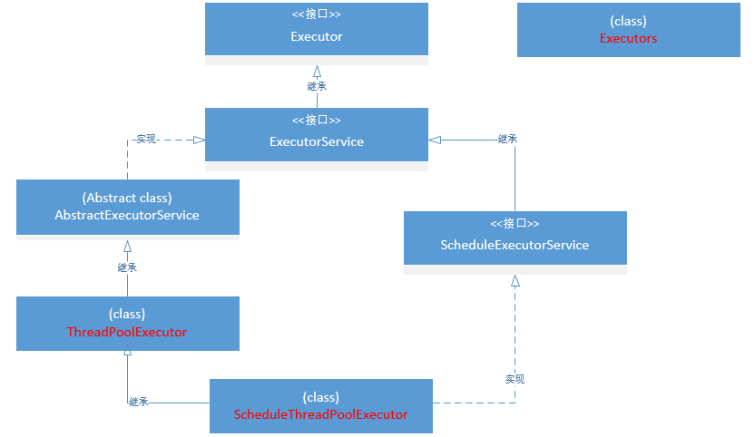

# Java并发编程系列-Executor框架
## 介绍
Executor框架是JDK1.5之后出现的，位于juc包中，是并发程序设计的工具之一。各个版本以来一直在进行修正。
Executor是执行者之意，表示任务的执行者，这里的任务指的是新的线程任务（实现Runnable接口的执行任务）。
整个Executor执行者框架包括多个接口和类，甚至还涉及到阻塞队列的使用，协同实现任务的执行。
下面是简单的Executor框架的类结构：<br/>

    
从上面的类结构中我们可以看到Executor接口是整个框架的祖接口，它大致规划了框架的结构，并定义了执行方法execute()，这个方法需要一个Runnable作为入参，表示执行一个线程任务。从这里也可以看出来这个框架的主要思想：将要执行的任务和具体的执行进行解耦，任务的内容单独定义为一个线程，任务的执行交给该框架进行，只需要将任务提交给框架即可（这个后面会提到）。Runnable入参就表示定义为单独线程的任务内容，execute方法则是执行任务，整个框架定义的就是这样一个任务执行器，Executor框架总的来说就是一个多线程任务执行框架。
## Executor接口
Executor接口是整个框架的总接口，正如上面所述，它描述了框架的主要实现思想：任务内容与执行的解耦。其源码很短，我们可以看看：
```java
package java.util.concurrent;
public interface Executor {

    /**
     * Executes the given command at some time in the future.  The command
     * may execute in a new thread, in a pooled thread, or in the calling
     * thread, at the discretion of the {@code Executor} implementation.
     *
     * @param command the runnable task
     * @throws RejectedExecutionException if this task cannot be
     * accepted for execution
     * @throws NullPointerException if command is null
     */
    void execute(Runnable command);
}
```
这是一个单独的接口，其内部只有一个execute()方法。我们看看其注释：在将来某一时刻执行给定的指令，可能会在一个新的线程、或一个线程池中的线程、或在正调用的线程中执行，这取决于Executor接口的具体实现。
注意：这个方法中的入参任务指令是必不可少的，不可传null，否则会报NullPointerException（空指针异常）。
## ExecutorService接口
ExecutorService接口继承了Executor接口，Executor接口仅仅描述了思想，定义了一个执行器，ExecutorService接口在其基础上进一步丰富了框架的接口，为框架定义了更多内容，包括：任务的提交，执行器的终止关闭等。
### 终止方法
#### 方法源码
```java
public interface ExecutorService extends Executor {
    //...
    void shutdown();
    boolean isShutdown();
    //...
}
```
#### 方法解析
如上源码，ExecutorService中定义了两个终止方法，这两个方法并不完全相同，第一个方法shutDown()的作用是终止新任务的接收，已接收的任务却需要继续执行。这是保证已提交任务全部执行的终止方法。第二个shutDownNow()方法属于强效终止方法，它会试图停止正在执行的线程任务，并且不再执行处于等待状态的其他任务，并且会将这些任务以列表的方式返回。
> 注意：
    第二个方法的试图停止，并不一定会停止，因为其实现会使用Thread.interrupt()方法来进行线程任务中断执行，但是如果任务线程不会响应该中断，则不会被终止。
### 任务提交方法
#### 方法源码
```java
public interface ExecutorService extends Executor {
    //...
    <T> Future<T> submit(Callable<T> task);
    <T> Future<T> submit(Runnable task, T result);
    Future<?> submit(Runnable task);
    //...
}
```
#### 方法解析
这三个任务提交方法采用方法重载的方式定义，其实均是对execute方法的再封装，对其进行扩展而来。因为execute方法只能接受Runnable入参，切无返回值。submit提交任务却拥有返回值，而且可以接收两种格式的任务，Callable和Runnable两种。不同的方法参数和返回值也略有不同。
第一种方法接收一个Callable入参，任务执行成功会返回一个表示该任务的Future，通过其get方法可获取到在Callable任务中指定的返回内容。
第二种方法接收一个Runnable入参和一个指定的返回值，任务执行成功会返回一个表示该任务的Future，通过其get方法可以获取到之前的入参result的值，即入参result即为预设的返回值。
第三种方法接收一个Runnable入参，任务执行成功会返回一个表示该任务的Future，通过get方法可得到null。
我们通过下面的实例来进行验证：
```java
public class ExecutorTest {
    public static void main(String[] args) throws Exception {
        ExecutorService executor = Executors.newCachedThreadPool();
        //第一种方法：入参为Callable
        Future<String> result1 = executor.submit(new Callable<String>() {
            @Override
            public String call() throws Exception {
                return "task2";//此处的task2即为返回的内容，即future.get()的值
            }
        });
        //第二种方法：入参为Runnable和T
        Future<String> result2 = executor.submit(new Runnable() {
            @Override
            public void run() {
                System.out.println("mmp");
            }
        },"task1");//此处的task1即为返回的内容，即future.get()的值
        //第三种方法：入参为Runnable
        Future<?> result3 = executor.submit(new Runnable() {
            @Override
            public void run() {
                System.out.println("nnd");
            }
        });
        System.out.println(result1.get());
        System.out.println(result2.get());
        System.out.println(result3.get());
    }
}
```
测试代码执行结果为：
```text
task2
mmp
task1
nnd
null
```
从上面的结果中也可以看出三个方法的不同之处。
### invokeAny方法
#### 方法源码
```java
public interface ExecutorService extends Executor {
    //...
    <T> T invokeAny(Collection<? extends Callable<T>> tasks) throws InterruptedException, ExecutionException;
    <T> T invokeAny(Collection<? extends Callable<T>> tasks,long timeout, TimeUnit unit) throws InterruptedException, ExecutionException, TimeoutException;
    //...
}
```
#### 方法解析
第一种方法表示执行给定的任务列表中的任务，如果某个任务成功完成，没有任何异常，则将该任务的结果返回，一旦成功或者异常被返回之后，任务列表中其他任务则取消执行，那么可以看出返回的必定是第一个执行成功的任务的结果或者最后一个任务的执行异常。
第二个方法是在第一个方法的基础上加上一个超时限制，如果在超时期满之前完成了某个任务则返回该任务的结果，其余同上。
> 注意：
    注意：这里写到一旦成功或者异常被返回，其实这里如果第一个任务执行的时候出现了异常，则同样会被返回，同样其他任务取消执行。

例子：
```java
public class ExecutorTest {
    public static void main(String[] args) throws Exception {
        ExecutorService executor = Executors.newCachedThreadPool();
        List<Callable<String>> callables = new ArrayList<>();
        callables.add(new Callable<String>() {
            @Override
            public String call() throws Exception {
                return "task1";
            }
        });
        callables.add(new Callable<String>() {
            @Override
            public String call() throws Exception {
                return "task2";
            }
        });
        callables.add(new Callable<String>() {
            @Override
            public String call() throws Exception {
                return "task3";
            }
        });
        callables.add(new Callable<String>() {
            @Override
            public String call() throws Exception {
                return "task4";
            }
        });
        String s = executor.invokeAny(callables);
        System.out.println(s);
    }
}
```
执行结果：
```text
task1
```
当第一个任务执行成功之后直接就结束，返回结果了。
### invokeAll方法
#### 方法源码
```java
public interface ExecutorService extends Executor {
    //...
    <T> List<Future<T>> invokeAll(Collection<? extends Callable<T>> tasks) throws InterruptedException;
    <T> List<Future<T>> invokeAll(Collection<? extends Callable<T>> tasks,long timeout, TimeUnit unit) throws InterruptedException;
    //...
}
```
#### 方法解析
这两个方法和上面的两个invokeAny方法结构类似，第一个方法表示执行给定的任务列表中的任务，当列表中的所有任务执行完毕之后，返回所有任务的结果组成的列表，此时列表中所有的Future中的isDone均为true，表示所有任务均被执行。
第二个方法同样在第一个方法的基础上加上了时限限制，表示在所有任务完成或者时限到期之后将所有任务的结果组成列表返回，此时列表中所有的Future中的isDone均为true。
> 注意：
    如果时限期满导致返回结果的话，那些未执行的任务的结果中是null，而isDone仍然为true，状态为6-INTERRUPTED（中断），而执行成功的任务的结果状态为2-COMPLETING（完成）。

例子：
```java
public class ExecutorTest {
    public static void main(String[] args) throws Exception {
        ExecutorService executor = Executors.newCachedThreadPool();
        List<Callable<String>> callables = new ArrayList<>();
        callables.add(new Callable() {
            @Override
            public Object call() throws Exception {
                return "task1";
            }
        });
        callables.add(new Callable() {
            @Override
            public Object call() throws Exception {
                return "task2";
            }
        });
        callables.add(new Callable() {
            @Override
            public Object call() throws Exception {
                return "task3";
            }
        });
        List<Future<String>> futures = executor.invokeAll(callables,1900L,TimeUnit.MICROSECONDS);// ceshi
        for(Future<String> future:futures){
            System.out.println(future.get());
        }
    }
}
```
测试第一个方法就将注解ceshi一行代码中调用参数的第二个和第三个参数去掉即可，这里设置1900毫秒在我的电脑上正好能有几率测试到完成一部分就超时的情况，其执行结果为：
执行结果为：
```text
task1
task2
    at java.util.concurrent.FutureTask.report(FutureTask.java:121)
    at java.util.concurrent.FutureTask.get(FutureTask.java:192)
    at xxxTest.main(xxxTest.java:135)
```
响应结果为：<br/>

全部成功的结果为：
```text
task1
task2
task3
```
响应结果为：<br/>

## AbstractExecutorService抽象类
这是一个抽象类，实现了ExecutorService接口。这是ExecutorService的默认实现，我们来看下AbstractExecutorService中实现的方法：<br/>

### newTaskFor方法
可以从中看出，AbstractExecutorService实现了之前我们介绍的ExecutorService中的大部分方法，包括三个任务提交方法，两个invokeAny和两个invokeAll方法，其中doInvokeAny方法是私有方法，被invokeAny调用，只是多出了两个newTaskFor方法。
newTaskFor方法是做什么的呢？
我们来看看源码。
#### 方法源码
```java
public abstract class AbstractExecutorService implements ExecutorService {
    //..
    protected <T> RunnableFuture<T> newTaskFor(Runnable runnable, T value) {
        return new FutureTask<T>(runnable, value);
    }
    protected <T> RunnableFuture<T> newTaskFor(Callable<T> callable) {
        return new FutureTask<T>(callable);
    }
    //...
}
```
#### 方法解析
可以看出，这两个newTaskFor是使用给定的参数组建一个FutureTask实例并返回。所以它的作用就是提供任务执行结果Future，只是这里提供的是FutureTask类型的Future，如果我们需要使用别的RunnableFuture的实现类型（FutureTask就是RunnableFuture的实现之一），我们可以自定义。
这两个方法被submit方法所调用，用于在任务执行之前，将其包装起来，然后调用execute执行即可，之前我们看过，execute的入参是Runnable类型，此处FutureTask的超接口RunnableFuture就实现了Runnable接口。所以可以直接将包装过的任务直接作为execute的入参进行执行。
### submit提交方法
下面我们就来看看三个submit方法：
#### 方法源码
```java
public abstract class AbstractExecutorService implements ExecutorService {
    //..
    public Future<?> submit(Runnable task) {
        if (task == null) throw new NullPointerException();
        RunnableFuture<Void> ftask = newTaskFor(task, null);
        execute(ftask);
        return ftask;
    }

    public <T> Future<T> submit(Runnable task, T result) {
        if (task == null) throw new NullPointerException();
        RunnableFuture<T> ftask = newTaskFor(task, result);
        execute(ftask);
        return ftask;
    }

    public <T> Future<T> submit(Callable<T> task) {
        if (task == null) throw new NullPointerException();
        RunnableFuture<T> ftask = newTaskFor(task);
        execute(ftask);
        return ftask;
    }
    //...
}
```
#### 方法解析
参考之前ExecuteService中的介绍和实例，我们可以轻松理解这里代码的含义，首先判断任务是否为null，若是null，则抛出空指针，否则使用newTaskFor将任务（和返回值）封装成为FutureTask，再将其作为入参调用execute进行任务执行。最后将之前封装的FutureTask作为返回值返回。
### invokeAny方法
这里实现了invokeAny，核心是doInvokeAny方法，我们可以看下源码：
#### 方法源码
```java
public abstract class AbstractExecutorService implements ExecutorService {
    //..
    public <T> T invokeAny(Collection<? extends Callable<T>> tasks)
        throws InterruptedException, ExecutionException {
        try {
            return doInvokeAny(tasks, false, 0);
        } catch (TimeoutException cannotHappen) {
            assert false;
            return null;
        }
    }
    public <T> T invokeAny(Collection<? extends Callable<T>> tasks,
                               long timeout, TimeUnit unit)
        throws InterruptedException, ExecutionException, TimeoutException {
        return doInvokeAny(tasks, true, unit.toNanos(timeout));
    }
    private <T> T doInvokeAny(Collection<? extends Callable<T>> tasks,
                                  boolean timed, long nanos)
        throws InterruptedException, ExecutionException, TimeoutException {
        if (tasks == null)
            throw new NullPointerException();
        int ntasks = tasks.size();
        if (ntasks == 0)
            throw new IllegalArgumentException();
        ArrayList<Future<T>> futures = new ArrayList<Future<T>>(ntasks);
        ExecutorCompletionService<T> ecs =
            new ExecutorCompletionService<T>(this);

        // For efficiency, especially in executors with limited
        // parallelism, check to see if previously submitted tasks are
        // done before submitting more of them. This interleaving
        // plus the exception mechanics account for messiness of main
        // loop.

        try {
            // Record exceptions so that if we fail to obtain any
            // result, we can throw the last exception we got.
            ExecutionException ee = null;
            final long deadline = timed ? System.nanoTime() + nanos : 0L;
            Iterator<? extends Callable<T>> it = tasks.iterator();

            // Start one task for sure; the rest incrementally
            futures.add(ecs.submit(it.next()));// 30行
            --ntasks;
            int active = 1;

            for (;;) {
                Future<T> f = ecs.poll();// 35行
                if (f == null) {
                    if (ntasks > 0) {
                        --ntasks;// 38行
                        futures.add(ecs.submit(it.next()));// 39行
                        ++active;// 40行
                    }
                    else if (active == 0)
                        break;
                    else if (timed) {// 44行
                        f = ecs.poll(nanos, TimeUnit.NANOSECONDS);// 45行
                        if (f == null)// 46行
                            throw new TimeoutException();// 47行
                        nanos = deadline - System.nanoTime();// 48行
                    }// 49行
                    else
                        f = ecs.take();
                }
                if (f != null) {// 53行
                    --active;
                    try {
                        return f.get();// 56行
                    } catch (ExecutionException eex) {
                        ee = eex;// 58行
                    } catch (RuntimeException rex) {
                        ee = new ExecutionException(rex);// 60行
                    }
                }
            }

            if (ee == null)
                ee = new ExecutionException();
            throw ee;// 67行

        } finally {
            for (int i = 0, size = futures.size(); i < size; i++)// 70行
                futures.get(i).cancel(true);// 71行
        }
    }
    //...
}
```
#### 方法解析
重点看看doInvokeAny方法：
1. 参数校验，主要是看任务列表是否存在任务
2. 优先执行一个任务，这个任务为任务列表tasks中的首个任务（30行），然后进入一个无限循环（当然会有退出条件）
3. 从执行器Executor的阻塞队列中移除队头的元素，并将该元素返回，如果队列为空队列，则这里返回值为null，此时会将优先提交的任务元素返回（35行），然后执行第53行
4. 执行器执行首个任务，执行56行，等待任务执行完成，如果任务执行成功，会在此处直接退出整个方法，一旦该任务执行出错，则会产生异常，并将异常保存在ee中（58行，60行），然后继续进行循环
5. 再次执行35行代码发现返回值为null，则会判断任务列表中的未执行任务数ntasks（该值初始为任务列表总任务数，但会随着任务的提交执行而逐渐递减，它的值就是任务列表中未提交执行的任务的数量）是否为0，此时该值一定不为0，则会执行38-40行代码，再次提交一个执行任务，然后会再次下一次循环，这次循环类似第4点
6. 一旦某个任务执行成功，就会将该任务的执行结果返回，但是一旦某个任务执行失败，则继续执行下个任务，如果所有任务都执行失败，则会将最后一个任务的失败异常抛出（这个异常将保存在ee中，一直到循环结束，由67行抛出）
7. 最后取消其他正在执行的任务（70-71行）
> 总结：
    该方法会返回任务列表中第一个执行成功的任务的执行结果或者是抛出异常，一旦抛出了异常，表示任务全部被执行，但是全部失败。一旦某个任务执行成功，则剩下的任务将不会再执行，而且会取消其他正在执行的任务。
    
> 注意：
    对于有超时限制的情况，会执行44-49行代码，每个任务执行时都会进行超时判断，一旦超时期满，则抛出超时异常，并在最后取消所有正在执行的任务（70-71行）。
    
### invokeAll方法
AbstractExecutorService中的两个invokeAll是分开实现的。如前所述，该方法用于执行一个任务列表，确保所有任务全部执行，也即All之意。我们分别来看看。
#### 无时限的invokeAll方法
##### 方法源码
```java
public abstract class AbstractExecutorService implements ExecutorService {
    //...
    public <T> List<Future<T>> invokeAll(Collection<? extends Callable<T>> tasks)
        throws InterruptedException {
        if (tasks == null)
            throw new NullPointerException();
        ArrayList<Future<T>> futures = new ArrayList<Future<T>>(tasks.size());
        boolean done = false;
        try {
            // 循环执行任务
            for (Callable<T> t : tasks) {
                RunnableFuture<T> f = newTaskFor(t);// 封装任务
                futures.add(f);
                execute(f);
            }
            // 循环等待任务完成，即使失败，异常也不作任何处理，继续下一个任务
            for (int i = 0, size = futures.size(); i < size; i++) {
                Future<T> f = futures.get(i);
                if (!f.isDone()) {
                    try {
                        f.get();
                    } catch (CancellationException ignore) {
                    } catch (ExecutionException ignore) {
                    }
                }
            }
            done = true;
            return futures;
        } finally {
            if (!done)
                for (int i = 0, size = futures.size(); i < size; i++)
                    futures.get(i).cancel(true);
        }
    }
    //...
}
```
##### 方法解析
源码很简单，就是循环执行任务列表tasks中的任务，然后将返回结果封装到futures结果列表中。第一个for循环就是循环执行任务，第二个for循环是为了保证所有的任务都执行完毕后再返回最终结果，如果某个任务的isDone为false,则代表其尚未执行完，调用get方法来等待其执行完毕，待所有任务执行完毕之后，将done修改为true,表示所有任务执行完毕，然后返回结果。
如果因为一些未知原因在代码走到最后finally块中时，done值还是false，那么就尝试对任务列表中的所有任务执行取消操作。
> cancel操作:
> ```java
> public interface Future<V> {
>    /**
>     * Attempts to cancel execution of this task.  This attempt will
>     * fail if the task has already completed, has already been cancelled,
>     * or could not be cancelled for some other reason. If successful,
>     * and this task has not started when {@code cancel} is called,
>     * this task should never run.  If the task has already started,
>     * then the {@code mayInterruptIfRunning} parameter determines
>     * whether the thread executing this task should be interrupted in
>     * an attempt to stop the task.
>     *
>     * <p>After this method returns, subsequent calls to {@link #isDone} will
>     * always return {@code true}.  Subsequent calls to {@link #isCancelled}
>     * will always return {@code true} if this method returned {@code true}.
>     *
>     * @param mayInterruptIfRunning {@code true} if the thread executing this
>     * task should be interrupted; otherwise, in-progress tasks are allowed
>     * to complete
>     * @return {@code false} if the task could not be cancelled,
>     * typically because it has already completed normally;
>     * {@code true} otherwise
>     */
>    boolean cancel(boolean mayInterruptIfRunning);
>    //...
> }
> ```
> 取消操作的目的是尝试取消当前正在执行的任务，如果任务已经完成或者已经取消又或者其他一些导致无法取消的原因发生，则取消失败；如果任务取消成功，且尚未开始执行，那么就不会再执行；如果任务已经开始执行，则mayInterruptIfRunning参数的值将决定执行任务的线程能否被取消

#### 带时限invokeAll方法
##### 方法源码
```java
public abstract class AbstractExecutorService implements ExecutorService {
    //...
    public <T> List<Future<T>> invokeAll(Collection<? extends Callable<T>> tasks,
                                         long timeout, TimeUnit unit)
        throws InterruptedException {
        if (tasks == null)
            throw new NullPointerException();
        long nanos = unit.toNanos(timeout);
        ArrayList<Future<T>> futures = new ArrayList<Future<T>>(tasks.size());
        boolean done = false;
        try {
            // 循环封装任务
            for (Callable<T> t : tasks)
                futures.add(newTaskFor(t));// 封装任务

            final long deadline = System.nanoTime() + nanos;
            final int size = futures.size();

            // Interleave time checks and calls to execute in case
            // executor doesn't have any/much parallelism.
            // 循环执行任务
            for (int i = 0; i < size; i++) {
                execute((Runnable)futures.get(i));
                // 最后期限减去当前时间得出剩余时限，一旦小于0，则超时退出
                nanos = deadline - System.nanoTime();
                if (nanos <= 0L)
                    return futures;// 超时退出
            }
            // 循环等待任务完成，一旦超时则退出
            for (int i = 0; i < size; i++) {
                Future<T> f = futures.get(i);
                if (!f.isDone()) {
                    if (nanos <= 0L)
                        return futures;
                    try {
                        f.get(nanos, TimeUnit.NANOSECONDS);
                    } catch (CancellationException ignore) {
                    } catch (ExecutionException ignore) {
                    } catch (TimeoutException toe) {
                        return futures;
                    }
                    nanos = deadline - System.nanoTime();
                }
            }
            done = true;
            return futures;
        } finally {
            // 一旦超时退出，done就是false，那么就会执行下面的任务取消操作
            if (!done)
                for (int i = 0, size = futures.size(); i < size; i++)
                    futures.get(i).cancel(true);
        }
    }
    //...
}
```
##### 方法解析
仔细一看，这个invokeAll方法相较无时限限制的invokeAll仅仅是增加了时限控制逻辑，倒也没有什么其他的改变，整体执行逻辑基本一致。
## ThreadPoolExecutor类
ThreadPoolExecutor类继承自AbstractExecutorService抽象类，
### 构造器
#### 构造器源码
```java
public class ThreadPoolExecutor extends AbstractExecutorService {
    //...
    private volatile int corePoolSize;// 核心线程池中保留的线程数量的最小值
    private volatile int maximumPoolSize;// 线程池中可以存在的最大线程数，
    private final BlockingQueue<Runnable> workQueue;// 任务的持有队列，在任务执行之前保存在队列中
    private volatile long keepAliveTime;// 当线程数量大于核心线程数，额外的线程在等待执行时间后就会销毁
    private volatile ThreadFactory threadFactory;// 创建新线程使用的线程工厂
    private volatile RejectedExecutionHandler handler;// 当线程边界和队列容量边界后执行阻塞时要使用的处理程序
    public ThreadPoolExecutor(int corePoolSize,
                              int maximumPoolSize,
                              long keepAliveTime,
                              TimeUnit unit,
                              BlockingQueue<Runnable> workQueue,
                              ThreadFactory threadFactory,
                              RejectedExecutionHandler handler) {
        if (corePoolSize < 0 ||
            maximumPoolSize <= 0 ||
            maximumPoolSize < corePoolSize ||
            keepAliveTime < 0)
            throw new IllegalArgumentException();
        if (workQueue == null || threadFactory == null || handler == null)
            throw new NullPointerException();
        this.acc = System.getSecurityManager() == null ?
                null :
                AccessController.getContext();
        this.corePoolSize = corePoolSize;
        this.maximumPoolSize = maximumPoolSize;
        this.workQueue = workQueue;
        this.keepAliveTime = unit.toNanos(keepAliveTime);
        this.threadFactory = threadFactory;
        this.handler = handler;
    }    
    //...
}
```
#### 源码解析
    流程：
- 当任务线程数小于corePoolSize核心线程数时，创建新线程执行当前任务，该线程执行完当前任务后，会从队列中获取下一个任务继续执行，即使在核心线程池中存在空闲线程，此时也要是优先创建新线程执行当前任务，等线程数达到核心线程数量之后不再创建；
- 当任务线程数大于等于corePoolSize核心线程数时，优先将任务放到队列中保存，等待执行；
- 当队列已满的情况下，如果当前的任务线程数量小于maximumPoolSize最大允许线程数，则新开一个线程执行当前任务，执行完后，会从队列中获取任务继续执行，如果队列已空，那么就等待keepAliveTime时间来获取新任务，超时线程销毁，当没有任务的时候，只保留核心线程数，哪怕是空闲的
- 当队列已满，且任务线程数达到最大允许线程数时，将拒绝执行当前任务，将任务推给RejectedExecutionHandler来处理

> 注意：其实无论是何时创建的线程，如果当前线程数大于核心线程数，那么只要这个线程等待给定时间无法获取到新任务就会销毁，直到剩余的线程数量达到核心线程数，不再销毁。
### execute方法
    任务执行方法，无返回值。
#### 方法源码
```java
public class ThreadPoolExecutor extends AbstractExecutorService {
    //...
    public void execute(Runnable command) {
        if (command == null)
            throw new NullPointerException();
        int c = ctl.get();// 获取锁
        // 如果当前工作线程数量小于核心线程数，则创建新线程执行当前任务
        if (workerCountOf(c) < corePoolSize) {
            if (addWorker(command, true))
                return;
            c = ctl.get();
        }
        // 如果线程数量已经大于等于核心线程数，那么如果能将任务顺利添加到阻塞队列则成功
        if (isRunning(c) && workQueue.offer(command)) {
            int recheck = ctl.get();
            if (! isRunning(recheck) && remove(command))
                reject(command);
            else if (workerCountOf(recheck) == 0)
                addWorker(null, false);
        }
        // 如果上面阻塞队列已满，无法添加新的任务，那么这里尝试创建新线程执行当前任务，
        // 如果总线程树小于最大允许线程数量，则成功，否则拒绝任务
        else if (!addWorker(command, false))
            reject(command);
    }
    //...
}
```


## Executors工具类
使用Executors工具类我们可以很方便的使用几个预定义的线程池
### FixedThreadPool
    固定线程池：核心线程数量和最大线程数量一致，超时时间为0，采用LinkedBlockingQueue队列，该队列为无界队列，能无限保存任务，池中的线程将永久保留即使空闲也不会自动销毁（需要手动销毁）
### SingleThreadExecutor
    单线程池：核心线程数量和最大线程数量均为1，超时时间为0，采用LinkedBlockingQueue队列，该队列为无界队列，能无限保存任务，池中有且仅有一个线程，且不会自动销毁，效果和固定线程池的nThread=1的效果相似
    适用于只需要有一个线程执行的情况下，比如存在非线程安全的多个操作时，使用单线程池可以将操作串行化，因为在线程池中永远只有一个线程在执行任务，多个任务必须要排着队等待被一个线程串行执行，这可以起到加锁的效果
### CachedThreadPool
    缓存线程池：核心线程数量为0，最大线程数量为整数最大值（无限），超时时间为60秒，采用SynchronousQueue队列，队列不能保存任务
    池中的线程在空闲60秒后会自动销毁
    适合执行大量的耗时较短且提交频繁的任务。
    如果耗时较长且提交频繁，那么就会导致内存中线程过多而拖慢系统。
