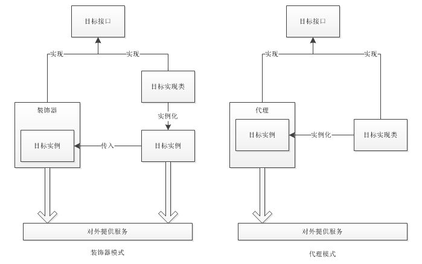

# Java设计模式系列-装饰器模式
## 一、概述
装饰器模式作用是针对目标方法进行增强，提供新的功能或者额外的功能。

不同于适配器模式和桥接模式，装饰器模式涉及的是单方，和代理模式相同，而且目标必须是抽象的。

而实际上，装饰器模式和代理模式的实现方式基本一致，只在目标的存在上有些差别，这个后面我们具体讲述。
## 二、初步分析
上面提到了两点：
- 涉及的是单方
- 目标是抽象的

我们来想一下，所谓单方主要指的是在整个装饰器模式中不存在双方调用，要解决的也不是双方调用的问题，而是解决单方提供对外服务的问题，这个单方在自行对外提供服务时，功能不足，或者我们需要额外添加一些新功能，这时就可以使用装饰器模式，来对这个单方进行增强。

目标抽象的意思是因为我们需要通过实现接口的方式来进行增强，因此目标必须抽象为接口。
## 三、实例
下面我们用我们生活中的一个例子来说明，我们用房子来作为目标：

房子接口：House
```java
/**
 * 目标接口：房子
 */
public interface House {
    void output();
}
```
具体的房子：DonghaoHouse
```
/**
 * 房子实现类
 */
public class DonghaoHouse implements House {
    @Override
    public void output() {
        System.out.println("这是董浩的房子");
    }
}
```
具体的房子：DongliangHouse
```java
/**
 * 房子实现类
 */
public class DongliangHouse implements House {
    @Override
    public void output() {
        System.out.println("这是董量的房子");
    }
}
```
装饰器：Decorator
```java
public class Decorator implements House {
    private House house;
    public Decorator(House house){
        this.house = house;
    }
    @Override
    public void output() {
        System.out.println("这是针对房子的前段装饰增强");
        house.output();
        System.out.println("这是针对房子的后段装饰增强");
    }
}
```
测试类：
```java
public class Clienter {
    public static void main(String[] args) {
        House donghaoHouse = new DonghaoHouse();
        House decorator = new Decorator(donghaoHouse);
        decorator.output();
    }
}
```
执行结果为：
```text
这是针对房子的前段装饰增强
这是董浩的房子
这是针对房子的后段装饰增强
```
## 四、解析
通过上面的例子我们可以看出，除了测试类外，只剩下接口和实现类了，即使是装饰器类也是目标接口的一个字类，这更能说明单方的说法，模式中所有的类都属于目标方。至于目标是抽象的更是如此，只有目标是抽象的，才可以使用装饰器模式来进行增强。

上面我们说过装饰器模式与代理模式基本相同，只存在少许差别。

我们需要从概念上了解代理和装饰的区别：
- 代理是全权代理，目标根本不对外，全部由代理类来完成。
- 装饰是增强，是辅助，目标仍然可以自行对外提供服务，装饰器只起增强作用。

上面两点提现到代码实现中是这样的：
代理模式
```java
public class Proxy implements House {
    private House house;
    public Decorator(){
        this.house = new DonghaoHouse();
    }
    @Override
    public void output() {
        System.out.println("这是针对目标的前段增强");
        house.output();
        System.out.println("这是针对目标的后段增强");
    }
}
```
装饰模式
```java
public class Decorator implements House {
    private House house;
    public Decorator(House house){
        this.house = house;
    }
    @Override
    public void output() {
        System.out.println("这是针对房子的前段装饰增强");
        house.output();
        System.out.println("这是针对房子的后段装饰增强");
    }
}
```
看出来了吗，装饰器中持有的目标实例是从构造器传入的，而代理中持有的目标实例是自己创建的。

那么这里又出现一个区别，代理模式和装饰器模式虽然都依赖于目标接口，但是代理针对的目标实现类是固定的，而装饰器模式可以随意指定，也就是说目标是可以自有扩展的。
## 五、使用场景
装饰器模式就是使用在对已有的目标功能存在不足，需要增强时，前提是目标存在抽象接口。
## 六、总结
我们要明白代理模式和装饰器模式的区别，区分二者的使用场景，如下图：


