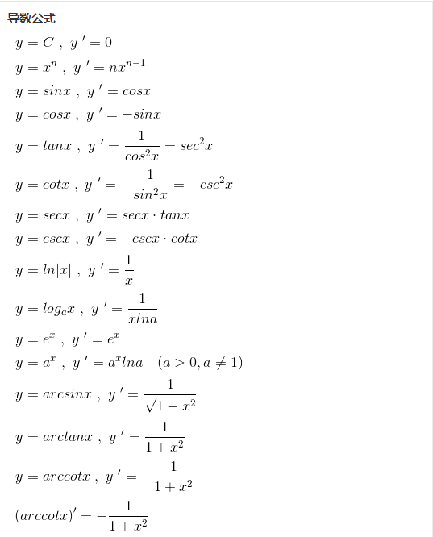

# 数据分析
## 一、常数e
常数e是数学常数之一，又名自然常数，欧拉数，纳皮尔数。

常数e是自然对数函数的底数，是一个无限不循环小数，且为超越数，其值约为2.71828。

> 超越数指的是不能作为有理代数方程的根的无理数，与代数数相反，例如圆周率π，自然常数e等

自然常数经常在公式中做对数的底。比如，对指数函数和对数函数求导时，就要使用自然常数。
## 二、导数
导数是微积分学中的重要概念，我们主要了解一下概念，最重要的是求导公式
### 2.1 概念
> 设函数y=f(x)在点x=x0及其附近有定义，当自变量x在x0处有改变量△x（△x可正可负），则函数y相应地有改变量△y=f(x0＋△x)－f(x0)，这两个改变量的比叫做函数y=f(x)在x0到x0＋△x之间的平均变化率.
>
> 如果当△x→0时，有极限，我们就说函数y=f(x)在点x0处可导，这个极限叫做f(x)在点x0处的导数（即瞬时变化率，简称变化率），记作f′(x0)或，
>
> 即函数f(x)在点x0处的导数就是函数平均变化率当自变量的改变量趋向于零时的极限．如果极限不存在，我们就说函数f(x)在点x0处不可导.
### 2.2 求导公式

### 2.3 引申
- 偏导数
偏导数表示的是多元函数上某一点的基于某一元的切线的斜率，常见的就是二元函数（两个未知数），偏导数就是该函数上某一点基于X轴或Y轴的切线的斜率

首先定位二元函数上一个点，然后基于这个点，做一个曲线，这个曲线在XY平面上的投影要平行于X轴或者Y轴，基于这个曲线在这个点做切线，那么就称该切线的斜率为该函数在该点基于Y轴或X轴的偏导数
- 方向导数

## 三、梯度

## 四、Tarlor
泰勒公式：泰勒公式在机器学习中主要应用于梯度迭代。

## 五、gini系数

## 六、信息熵与组合数

